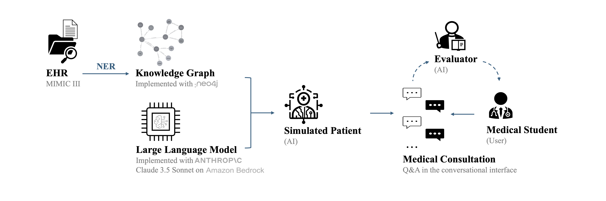
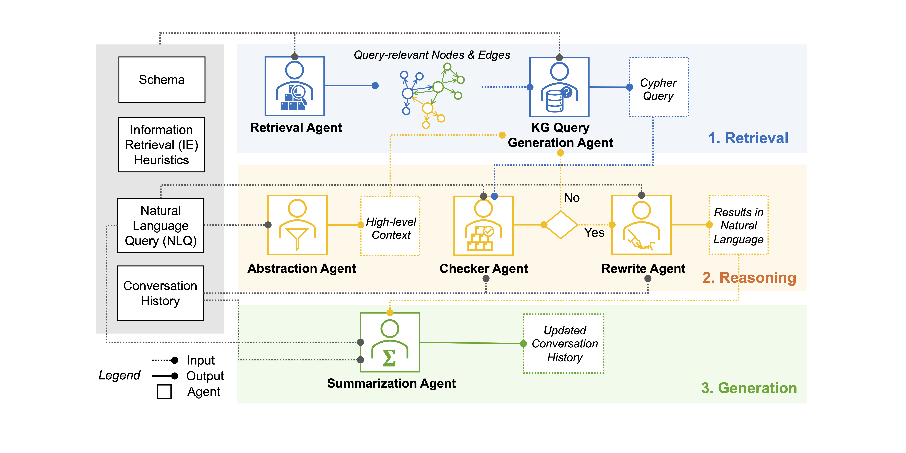
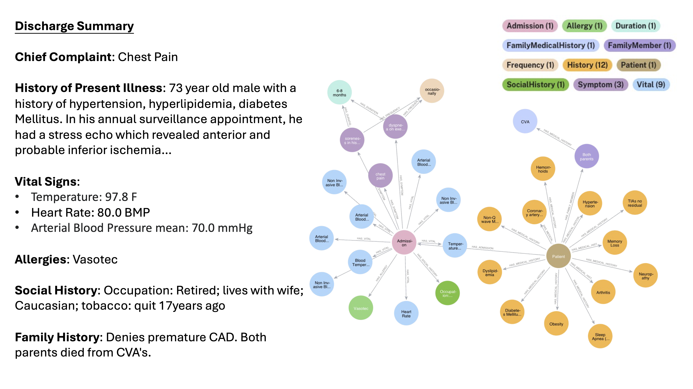
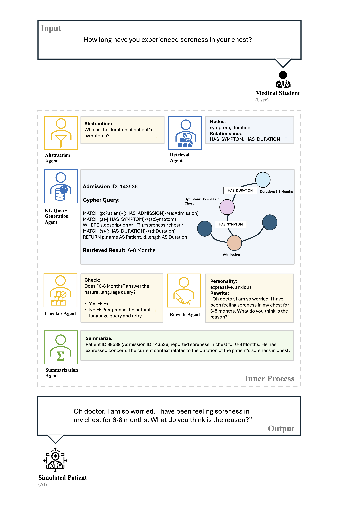

# AIPatient: Large Language Model Powered Simulated Patient for Medical Education

[](https://github.com/huiziy/AIPatient/blob/main/LICENSE)

*Revolutionize medical training with **AIPatient**: our LLM-powered simulated patient leverages the leading Claude 3.5 Sonnet model and the MIMIC III dataset to offer realistic and diverse clinical scenarios. Enhance your educational experience with accurate, data-driven interactions and comprehensive feedback, all designed to improve training outcomes and patient care. Join us in transforming medical education with cutting-edge technology!*


<p align="center"><strong>Figure 1:</strong> AIPatient Structure</p>

<p align="center" style="font-size:24px;><strong>Realistic</strong> -- <strong>Diverse</strong> -- <strong>Factual</strong> -- <strong>Scalable</strong></p>

**Motivation:** Traditional medical education faces many challenges, including limited access to diverse clinical experiences, inconsistency in training, high costs, and the limited availability of standardized patients. Integrating new technologies such as Large Language Models (LLM) can enhance the learning experience and improve training outcomes. 

**Overview:** In this project, we develop **AIPatient**, a LLM powered simulated patient based on Electronic Health Records (EHR) data. Leveraging the MIMIC III dataset, which includes over 46k patients, we begin by extracting relevant medical entities and their relationships to construct a comprehensive knowledge graph (KG). Next, we develope a multi-agent system and propose the **Reasoning RAG** framework to accurately represent the information within the KG, ensuring minimal hallucination and high factual accuracy. By incorporating personalities, AIPatient can mimic real-life interactions, responding to questions and presenting symptoms in a manner similar to actual patients. In future iterations, we aim to incorporate evaluator agent to provide feedback on user performance, potentially enhancing medical training and ultimately improving patient care outcomes. 

## LLM Agent Interaction


<p align="center"><strong>Figure 2:</strong> AIPatient Multi-Agent</p>

<strong>Figure 2</strong> presents the multi-agent system, designed with Reasoning RAG framework (Retrieval, Reasoning, Generation). Each rounds, agents interact to ensure accurate data retrieval and realistic generation. The system is also memory-perserving to ensure multi-round capabilities. 

## From EHR to Knowledge Graph


<p align="center"><strong>Figure 3:</strong> Knowledge Graph Construction with Electronic Health Records</p>

<strong>Figure 3</strong> provides an example of KG (right) constructed using EHR data (left). In the current KG, we focus on 12 node types (e.g. Admission, Symptom) and 11 relationships (e.g. HAS_SYMPTOM). The rich and diverse notes data in MIMIC III presents opportunities for mining additional medical entities and relationships. 

## Case Study


<p align="center"><strong>Figure 4:</strong> AIPatient Interaction Example (single round) </p>

In <strong>Figure 4</strong>, we present one round of user-AIPatient interaction. Beginning with user's natural language query input, the backend of AIPatient engages various agents and update the session state accordingly. Finally, the Simulated Patient answers the user's query using natural language. 

## QuickStart
### Install Environment
```
conda create --name aipatient python=3.9
conda activate aipatient

git clone [https://github.com/huiziy/AIPatient2024.git]

cd AIPatient2024
pip install -r requirements.txt
```

### Set up API keys
Currently, AIPatient supports Claude 3.5 Sonnet. To use Claude 3.5 Sonnet on Amazon Bedrock, follow [this guide](https://docs.anthropic.com/en/api/claude-on-amazon-bedrock) to install AWS CLI, set up AWS IAM account and request access for Claude 3.5 Sonnet. 

After obtaining "Access key ID" and "Secret access key". Navigate to ```secrets.txt``` file in this repo and add your keys after "Access_key_ID" and "Secret_access_key" respectively. 

### Run AIPatient Interface
The AIPatient interface is designed with [streamlit](https://streamlit.io). To run the app locally:
```
cd src
streamlit run AIPatient_Interface.py
```

### Demo


## Our Core Team
Huizi Yu,  huiziy@amazon.com, Data Scientist @ Amazon Science, VA, US 
<br />Lizhou Fan, lizhouf@umich.edu, Research Fellow @ Harvard Medical School (Incoming), MA, US 
<br />Jiayan Zhou, jyzhou@stanford.edu, Research Fellow @ Stanford University, CA, US
<br />Lingyao Li, lingyaol@umich.edu, Research Fellow @ University of Michigan, MI, US

## License
The source code of AIPatient is licensed under [Apache 2.0](https://github.com/tatsu-lab/stanford_alpaca/blob/main/LICENSE). The intended purpose is solely for research use.

## Disclaimer
AIPatient is powered by Anthropic's Claude 3.5 Sonnet via Amazon Bedrock to comform with the [Resonsible Data Use Agreement](https://physionet.org/news/post/gpt-responsible-use). We confirm the data is not shared with third parties, including sending it through APIs or using it in online platforms.

This repo contains code for agents and QA Interface; some data cleaning and knowledge graph creation code are omitted and will be made public after paper publication. 

